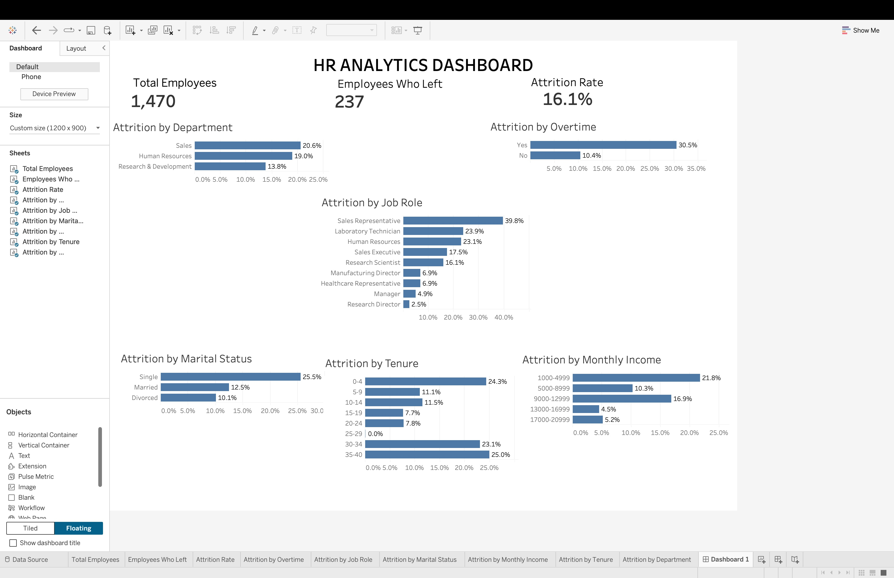

# HR Analytics Dashboard

## Project Overview

This project analyzes employee attrition data to identify workforce trends and factors associated with employee turnover. SQL was used to analyze the dataset and calculate key HR metrics, while Tableau was used to build an interactive dashboard that allows users to explore attrition patterns across departments, job roles, overtime status, marital status, tenure, and monthly income.

## Business Problem

Employee turnover can increase recruitment costs, disrupt operations, and lead to the loss of organizational knowledge. The goal of this project is to analyze employee attrition and identify workforce segments experiencing higher attrition rates.

The analysis focuses on the following questions:

- What is the overall employee attrition rate?
- Which departments have the highest attrition rates?
- Which job roles experience the highest attrition?
- How does overtime relate to employee attrition?
- How does attrition vary by employee tenure?
- How does monthly income relate to attrition?
- How does attrition vary by marital status?

## Tools Used

- **SQL (SQLite)** – Data querying and analysis
- **Tableau** – Interactive dashboard development and data visualization
- **Excel** – Data profiling and exploratory analysis
- **Visual Studio Code** – SQL development and project organization
- **GitHub** – Version control and project documentation

## Key Metrics

- **Total Employees:** 1,470
- **Employees Who Left:** 237
- **Overall Attrition Rate:** 16.1%

## Key Findings

- Sales had the highest departmental attrition rate at **20.6%**.
- Sales Representatives had the highest job-role attrition rate at **39.8%**.
- Employees working overtime had an attrition rate of **30.5%**, compared with **10.4%** for employees who did not work overtime.
- Single employees had the highest attrition rate by marital status at **25.5%**.
- Employees with **0–4 years of tenure** had an attrition rate of **24.3%**, indicating elevated turnover among newer employees.
- Employees earning between **$1,000 and $4,999 per month** had an attrition rate of **21.8%**.
- Employees who worked overtime and had **0–4 years of tenure** experienced a **43.1% attrition rate**, substantially higher than the overall company attrition rate of 16.1%.

## Tableau Dashboard

The interactive Tableau dashboard provides a consolidated view of employee attrition and allows users to explore how attrition varies across key workforce characteristics.

The dashboard includes interactive filtering by department and job role, allowing users to analyze attrition patterns within specific employee segments. 

### Live Interactive Dashboard

[View the interactive HR Analytics Dashboard on Tableau Public](https://public.tableau.com/app/profile/ansh.patel4476/viz/HRAnalyticsDashboard_17841540192660/Dashboard1?publish=yes)

## Dashboard Features

- Total Employees KPI
- Employees Who Left KPI
- Overall Attrition Rate KPI
- Attrition by Department
- Attrition by Overtime Status
- Attrition by Job Role
- Attrition by Marital Status
- Attrition by Monthly Income
- Attrition by Employee Tenure
- Interactive Department filtering
- Interactive Job Role filtering

## SQL Analysis

SQL queries were used to calculate and analyze employee attrition across multiple dimensions, including department, job role, overtime status, marital status, employee tenure, and monthly income.

The SQL analysis also examined combined risk factors to identify employee groups experiencing particularly high attrition.

The complete SQL analysis is available in:

- `SQL/queries.sql` – SQL queries used for the analysis
- `SQL/SQL_Results.md` – Documentation of SQL findings and results

## Project Structure

HR-Analytics-Dashboard/

- `Data/`
  - `Raw/` – Original HR attrition dataset
  - `Cleaned/` – Cleaned and prepared datasets
- `Documentation/` – Project documentation and analysis notes
- `Images/`
  - `HR_Analytics_Dashboard.jpg` – Final Tableau dashboard image
- `SQL/`
  - `hr_analytics.db` – SQLite database
  - `queries.sql` – SQL analysis queries
  - `SQL_Results.md` – SQL analysis results and findings
- `Tableau/`
  - `HR Analytics Dashboard.twbx` – Tableau packaged workbook
- `README.md` – Project overview and documentation

## Business Recommendations

Based on the analysis, organizations seeking to reduce employee turnover should consider:

- Monitoring workloads and reducing excessive overtime, particularly among newer employees.
- Developing targeted retention strategies for high-turnover roles such as Sales Representatives.
- Strengthening onboarding, engagement, and career-development programs for employees in their first few years with the company.
- Reviewing compensation and advancement opportunities for lower-income employee groups.
- Using workforce analytics to proactively identify employee segments with multiple attrition risk factors.

## Conclusion

The analysis identified several workforce characteristics associated with elevated employee attrition. Overtime, early employee tenure, job role, and income level emerged as important factors in understanding turnover patterns.

The combination of overtime and early tenure was particularly notable, with employees working overtime during their first four years at the company experiencing a **43.1% attrition rate**.

By combining SQL analysis with an interactive Tableau dashboard, this project demonstrates how workforce data can be transformed into actionable insights that support employee retention and workforce planning.
